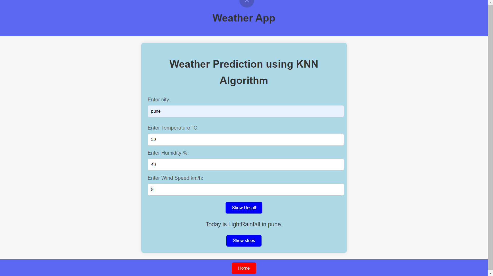

# SkyCask

## Overview

This project involves building a weather prediction application using the k-Nearest Neighbors (k-NN) algorithm. The application allows users to input weather parameters for a specific city and predicts the weather condition based on the k-NN algorithm.

## Project Details

### Project Overview

- The project is built as a React application utilizing the k-NN algorithm to predict weather conditions.
- Users can input parameters such as temperature, humidity, and wind speed for a particular city.
- The application calculates the nearest neighbors based on the input parameters and predicts the weather condition.

### Technology

- The application is built using **React**, a popular JavaScript library for building user interfaces.
- **CSS** is used for styling components and providing a user-friendly interface.

### Algorithm Description

The k-Nearest Neighbors (k-NN) algorithm is a versatile and intuitive machine learning technique used for both classification and regression tasks. Here's a more detailed breakdown of how the algorithm works:

1. **Initialization**:  
   The algorithm begins by loading the dataset containing examples with their corresponding labels. Each example represents a data point in a multidimensional feature space.

2. **Choose the Number of Neighbors (k)**:  
   The value of k is a crucial parameter in k-NN, representing the number of nearest neighbors to consider when making predictions. The choice of k influences the bias-variance tradeoff. Smaller values of k lead to more flexible models with high variance but low bias, while larger values of k result in smoother decision boundaries with low variance but high bias.

3. **Calculate Distance**:  
   For each query instance, the algorithm calculates the distance between the query instance and all the instances in the dataset. The distance metric used is typically Euclidean distance, although other distance metrics such as Manhattan distance or Minkowski distance can also be employed depending on the nature of the data.

4. **Find Nearest Neighbors**:  
   Once distances are calculated, the algorithm identifies the k instances with the smallest distances to the query instance. These instances constitute the nearest neighbors of the query instance and are used to make predictions.

5. **Determine Majority Vote (Classification) / Calculate Average (Regression)**:  
   - For classification problems, the algorithm determines the class labels of the k nearest neighbors and performs a majority vote to decide the class label of the query instance.
   - In regression problems, the algorithm calculates the average of the target values (e.g., temperature, humidity) of the k nearest neighbors.

6. **Output Result**:  
   Finally, the algorithm outputs the predicted class label (for classification) or the predicted value (for regression) for the query instance.

### UI Design Details

- The UI includes input fields for users to enter the city name, temperature, humidity, and wind speed.
- There's a button to trigger the prediction process and display the predicted weather condition.
- Additional buttons allow users to navigate between pages, such as returning to the home page or viewing algorithm steps.

## Screenshots

### Home Page


### Output



## How to Run the Project

1. **Clone the Repository**:
   ```sh
   git clone https://github.com/yourusername/SkyCastn.git
   cd SkyCast
